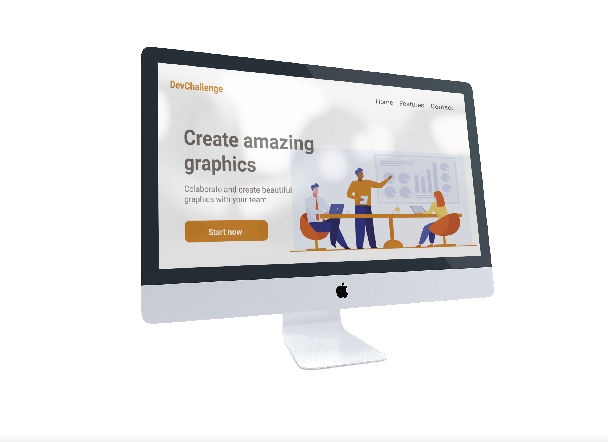
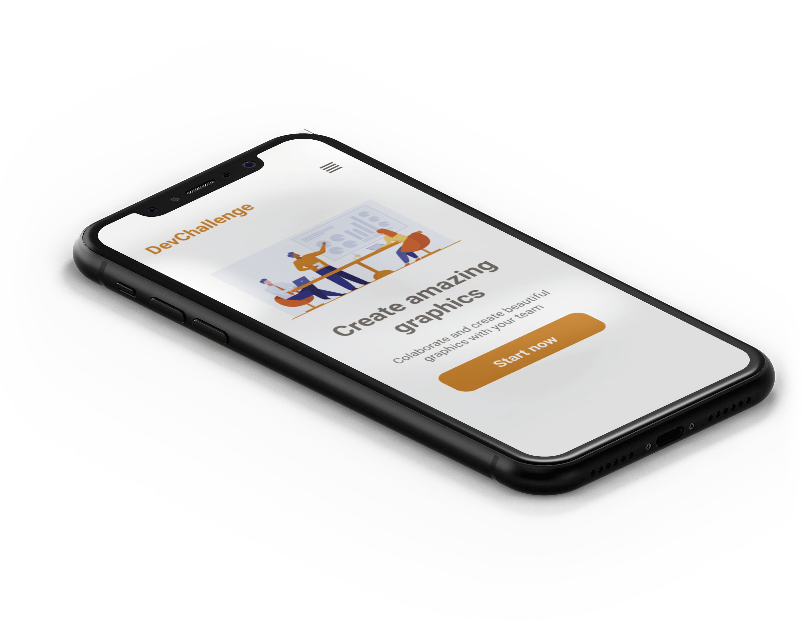

<div align="center">
  <h1>AmazingGraph</h1>
  <p>Landing page para criar gráficos incríveis</p>
  
   
</div>

---
<h3 align="center">
  <a href="https://cleilsonandrade.github.io/AmazingGraph-devchallenge/">Acessar demonstração</a>
</h3>

## Índice

* [Descrição](#descrição)
* [Features](#features) 
* [Techs](#techs) 
* [Design](#design)
  * [Cores](#cores)
  * [Tipo de fonte](#tipo-de-fonte)
* [Instalação](#instalação)
* [Links Contato](#links-contato)
* [Links DevChallenge](#links-devchallenge)
* [Licença](#licença)

# Descrição
Página desenvolvida com base nos requisitos do [desafio](https://github.com/Lorenalgm/AmazingGraph) oferecido pela [**DevChallenge**](https://devchallenge.now.sh/).

## Features:
- [x] Responsividade<br>

# Techs: 
- **HTML**
- **CSS**

# Design:
- O modelo final para desktop e mobile está disponível na pasta `./design`
- Imagens disponíveis na pasta `./assets`<br>

## Cores:
- Orange: #D2872C<br>
- Gray: #766F68<br>

## Tipo de fonte:
- **Roboto**

# Instalação:
```bash
  # Clone este repositório:
  $ git clone https://github.com/CleilsonAndrade/AmazingGraph-devchallenge
  $ cd ./AmazingGraph-devchallenge
```

# Links Contato
- **Linkedin:** https://www.linkedin.com/in/cleilson-andrade/<br>
- **GitHub:** https://github.com/CleilsonAndrade<br>

# Links DevChallenge
**Site:** https://www.devchallenge.com.br/ <br>
**Discord:** https://discord.gg/yvYXhGj <br>
**Linkedin:** https://www.linkedin.com/company/devchallenge/<br>
**Twitter:** https://twitter.com/dev_challenge<br>
**Instagram:** https://www.instagram.com/devchallenge/<br>

# Licença
<p align="center"><a href="https://github.com/CleilsonAndrade/AmazingGraph-devchallenge/blob/master/LICENSE"></a></p>
